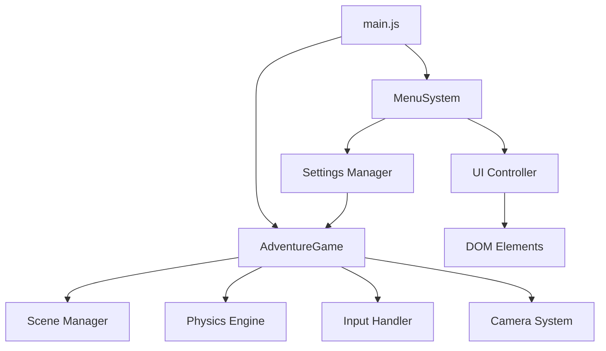

# 🔧 AIdventure - Technical Design Document (TDD)

**Version:** 1.0  
**Date:** December 2024  
**Target Platform:** Web Browsers (ES6+)  
**Engine:** Babylon.js 8.0  

---

## 📋 **Technical Overview**

### **Architecture Philosophy**
- **Modular Design**: Separate concerns into focused modules
- **ES6 Standards**: Modern JavaScript with imports/exports
- **Event-Driven**: Decoupled systems communicating via events
- **Performance First**: 60 FPS target with efficient resource management

### **Technology Stack**
```
Frontend:
├── Babylon.js 8.0      # 3D Rendering Engine
├── Cannon.js           # Physics Simulation
├── HTML5 Canvas        # Render Target
├── ES6 Modules         # Code Organization
└── CSS3                # UI Styling

Development:
├── Live-Server         # Development Server
├── Git                 # Version Control
└── Browser DevTools    # Debugging
```

---

## 🏗️ **System Architecture**

### **Module Structure**
```
AIdventure/
├── Core Systems
│   ├── game.js         # Main game engine and logic
│   ├── menu.js         # UI and settings management
│   └── main.js         # Application bootstrap and bridge
├── Assets
│   ├── index.html      # Game container and UI elements
│   ├── styles.css      # Game UI styling
│   └── menu.css        # Menu system styling
├── Dependencies
│   └── vendor/         # External libraries (Babylon.js, Cannon.js)
└── Documentation
    └── docs/           # Technical and design documentation
```

### **Data Flow Architecture**


---

## 🎮 **Core Systems**

### **1. Game Engine (game.js)**

#### **Class: AdventureGame**
**Responsibilities:**
- Scene management and rendering
- Physics simulation integration
- Player character control
- Camera system management
- Interaction system
- Game state management

#### **Key Properties:**
```javascript
{
    // Core Babylon.js objects
    engine: Engine,
    scene: Scene,
    camera: FreeCamera,
    player: Mesh,
    
    // Game state
    gameStarted: boolean,
    inventoryOpen: boolean,
    gamePaused: boolean,
    
    // Movement tracking
    keys: Object,
    cameraAnimation: Object,
    
    // Systems
    cameraSettings: Object,
    playerStats: Object,
    inventory: Array,
    interactables: Array
}
```

#### **Critical Methods:**
- `init()`: Async initialization of all systems
- `update()`: Main game loop (called per frame)
- `startGame()`: Game session initialization
- `applyCameraSettings()`: Dynamic camera configuration
- `updateCameraEffects()`: Frame-by-frame camera animation

### **2. Menu System (menu.js)**

#### **Class: MenuSystem**
**Responsibilities:**
- Settings persistence (localStorage)
- UI state management
- Game-menu communication bridge
- Input validation and sanitization

#### **Settings Architecture:**
```javascript
settings: {
    // Graphics
    graphics: "medium",
    fov: 75,
    
    // Camera controls
    sensitivity: 1.0,
    invertMouseY: false,
    smoothCamera: true,
    cameraSpeed: 50,
    
    // Camera effects
    headBobEnabled: true,
    headBobIntensity: 0.5,
    movementTiltEnabled: true,
    movementTiltIntensity: 1.0,
    
    // Audio
    masterVolume: 100,
    musicVolume: 80,
    sfxVolume: 90,
    
    // Controls
    keybinds: Object
}
```

### **3. Application Bridge (main.js)**

#### **Purpose:**
- Module loading and initialization
- Settings synchronization between menu and game
- Global function exposure for HTML event handlers
- Development environment setup

---

## 🎥 **Camera System**

### **Advanced Camera Features**

#### **Head Bob System**
```javascript
updateCameraEffects() {
    if (!this.cameraSettings.headBobEnabled || !this.cameraAnimation.isMoving) 
        return;
    
    // Physics-based bobbing calculation
    const deltaTime = this.engine.getDeltaTime() / 1000;
    const bobSpeed = this.cameraAnimation.isRunning ? 
        this.cameraSettings.runningBobSpeed : 
        this.cameraSettings.walkingBobSpeed;
    
    this.cameraAnimation.bobTimer += deltaTime * bobSpeed;
    
    // Sine wave calculations for natural movement
    const verticalBob = Math.sin(this.cameraAnimation.bobTimer) * intensity * 0.3;
    const horizontalBob = Math.sin(this.cameraAnimation.bobTimer * 0.5) * intensity * 0.15;
    
    // Apply to camera position
    this.camera.position.y = baseY + verticalBob + crouchOffset;
    this.camera.position.x = baseX + horizontalBob;
}
```

#### **Movement Tilt System**
- **Purpose**: Subtle camera roll during strafing for immersion
- **Implementation**: Smooth interpolation between target tilt angles
- **Range**: ±2 degrees maximum to prevent motion sickness

#### **Pointer Lock Management**
- **Security Handling**: Advanced cooldown system prevents browser security errors
- **State Tracking**: Comprehensive pointer lock state management
- **Fallback Systems**: Graceful degradation if pointer lock fails

---

## ⚙️ **Physics Integration**

### **Cannon.js Implementation**

#### **Physics Setup**
```javascript
initializePhysics() {
    try {
        // Primary: Cannon.js with optimizations
        this.scene.enablePhysics(
            new Vector3(0, -9.81, 0), 
            new BABYLON.CannonJSPlugin(true, 10, CANNON)
        );
    } catch (error) {
        // Fallback: Basic Babylon.js physics
        this.scene.enablePhysics(new Vector3(0, -9.81, 0));
    }
}
```

#### **Player Physics**
- **Impostor Type**: SphereImpostor for smooth collision
- **Movement**: Physics-based with velocity manipulation
- **Collision**: Full environment collision detection
- **Jump System**: Impulse-based jumping with ground detection

### **Performance Optimizations**
- **Collision Layers**: Selective collision detection
- **Physics Timestep**: Fixed 10ms timestep for consistency
- **Impostor Management**: Efficient creation/destruction

---

## 🎨 **Rendering Pipeline**

### **Babylon.js Rendering**

#### **Scene Composition**
```javascript
Scene Architecture:
├── Lighting System
│   ├── HemisphericLight (ambient)
│   └── DirectionalLight (sun + shadows)
├── Environment
│   ├── Ground plane (physics enabled)
│   ├── Procedural trees (static impostors)
│   └── Interactive objects (dynamic impostors)
└── Post-Processing
    ├── Glow Layer (magical effects)
    └── Shadow Generator (dynamic shadows)
```

#### **Material System**
- **StandardMaterial**: PBR-ready materials for all objects
- **Emission Maps**: Self-illuminating magical objects
- **Color Management**: Consistent color palette across materials

#### **Performance Features**
- **Hardware Scaling**: Dynamic resolution adjustment
- **Frustum Culling**: Automatic off-screen object culling
- **Level-of-Detail**: Distance-based rendering optimization

---

## 💾 **Data Management**

### **Settings Persistence**
```javascript
Storage Strategy:
├── localStorage
│   ├── Key: "adventureGameSettings"
│   ├── Format: JSON serialization
│   ├── Validation: Type checking on load
│   └── Fallback: Default settings object
└── Runtime Sync
    ├── Menu ↔ Game communication
    ├── Real-time setting application
    └── Error handling for missing values
```

### **Inventory System**
```javascript
Inventory Data Structure:
{
    items: [
        {
            id: "gold_coin",
            name: "Gold Coin",
            description: "Valuable currency",
            quantity: 5,
            slot: 0
        }
    ],
    selectedSlot: 0,
    maxSlots: 8
}
```

---

## 🔌 **Input System**

### **Keyboard Input Handling**
```javascript
Input Architecture:
├── KeyDown/KeyUp Events
│   ├── State tracking in keys object
│   ├── Configurable key bindings
│   └── Modifier key support (Shift, Ctrl)
├── Movement Processing
│   ├── Frame-rate independent movement
│   ├── Physics velocity application
│   └── Animation state updates
└── Special Actions
    ├── Interaction detection (E key)
    ├── Inventory toggle (I key)
    └── Pause/Resume (Escape key)
```

### **Mouse Input Management**
- **Pointer Lock API**: Full mouse capture for camera control
- **Sensitivity Scaling**: User-configurable mouse sensitivity
- **Y-Axis Inversion**: Optional inverted mouse look
- **Smooth Camera**: Interpolated camera movement

---

## 🔧 **Build & Development**

### **Development Workflow**
```bash
Development Commands:
├── npm run dev          # Start live development server
├── npm start           # Production server
└── python -m http.server  # Alternative local server
```

### **File Structure Requirements**
- **ES6 Modules**: All JavaScript uses import/export
- **HTML5 Standards**: Semantic markup with accessibility
- **CSS3 Features**: Modern styling with flexbox/grid
- **Asset Management**: CDN delivery for external libraries

### **Browser Compatibility**
```
Supported Browsers:
├── Chrome/Edge 80+     ✅ Full support
├── Firefox 75+         ✅ Full support
├── Safari 13+          ✅ Full support
└── Mobile Browsers     ⚠️ Limited (touch controls needed)
```

---

## 🚀 **Performance Considerations**

### **Optimization Strategies**

#### **Rendering Optimizations**
- **Draw Call Minimization**: Instanced rendering for similar objects
- **Texture Management**: Efficient texture atlas usage
- **Shader Optimization**: Optimized material shaders
- **Garbage Collection**: Minimal object creation in game loop

#### **Memory Management**
```javascript
Memory Optimization:
├── Object Pooling
│   ├── Reuse of temporary objects
│   ├── Vector3 object recycling
│   └── Animation frame cleanup
├── Asset Management
│   ├── Texture sharing between materials
│   ├── Geometry instancing
│   └── LOD system for distant objects
└── Event Cleanup
    ├── Proper event listener removal
    ├── Physics impostor disposal
    └── Scene cleanup on restart
```

#### **Performance Monitoring**
- **Frame Rate Tracking**: Built-in FPS monitoring
- **Memory Profiling**: Browser DevTools integration
- **Bottleneck Identification**: Performance timing APIs

---

## 🐛 **Error Handling & Debugging**

### **Error Management Strategy**
```javascript
Error Handling Hierarchy:
├── Try/Catch Blocks
│   ├── Physics initialization fallbacks
│   ├── Asset loading error recovery
│   └── Settings parsing validation
├── Console Logging
│   ├── Debug mode verbose logging
│   ├── Error state reporting
│   └── Performance metrics
└── User Feedback
    ├── Graceful degradation messages
    ├── Loading state indicators
    └── Error recovery suggestions
```

### **Debugging Tools**
- **Console Logging**: Comprehensive debug output
- **Visual Debugging**: Wireframe and impostor visualization
- **State Inspection**: Runtime game state monitoring
- **Performance Profiling**: Built-in timing measurements

---

## 🔮 **Future Technical Considerations**

### **Scalability Preparations**
- **Modular Architecture**: Easy addition of new systems
- **Component System**: Potential ECS implementation
- **Asset Pipeline**: Preparation for external asset loading
- **Networking Layer**: Foundation for multiplayer features

### **Technology Evolution**
- **WebGPU Migration**: Future graphics API support
- **WebXR Integration**: VR/AR capability preparation
- **Service Workers**: Offline gaming capability
- **Progressive Web App**: Mobile app-like experience

---

**Document Status**: Current implementation reference  
**Last Updated**: December 2024  
**Next Review**: Q1 2025 